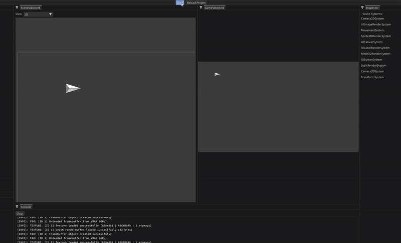

### Vertex Engine

**Vertex Engine** is a game engine supporting both **2D and 3D rendering**, designed for rapid iteration and flexibility. It utilizes an **Entity-Component-System (ECS)** architecture to manage entities efficiently and offers **C++ scripting** with **hot-reloading** capabilities, allowing developers to see code changes in real-time without restarting the editor.

Key features:

* **ECS Architecture**: Streamlines entity management through components and systems.

* **Hot-Reloading**: Instantly apply code changes during runtime.

* **Code Generation Tool**: The `VEHeaderTool` parses user-defined components/systems, generates reflection data, and enables custom UI and serialization.

* **Cross-Platform**: Built with modern C++ and compatible with Windows (additional platforms in development).

---

### Building the Engine from Source

The project uses **Premake** to generate platform-specific build files. Follow these steps:

1. **Generate Build Files**:\
   Run `gen_vs.bat` (Windows) to create a Visual Studio solution.

2. **Build the Solution**:\
   Open the generated `.sln` file in Visual Studio and compile the project.

3. **Launch the Editor**:\
   After compilation, run the `VertexEditor` target to start the engine.

For other platforms, modify the Premake script (`premake5.lua`) and regenerate the build files.

---

### Editor Interface  
The Vertex Editor features a **Unity-inspired layout** with intuitive panels for seamless workflow. Below are the core panels:  

<div align="center">
  
  <br/><em>Vertex Editor Interface</em>
</div>  

---

#### Key Panels:  
- **Hierarchy**  
  Manage entities: add, remove, parent/reparent, or create **Constructs** (prefabs).  
- **Inspector**  
  Modify components, enable/disable entities, rename entities, and tweak component properties.  
- **Scene Viewport**  
  Build and visualize scenes through the editor camera. Supports real-time interaction with entities.  
- **Game View**  
  Preview the scene from the main camera’s perspective.  
- **Console**  
  Display logs, warnings, and errors for debugging.  
- **Status Bar**  
  Monitor performance metrics like FPS, frame time, and entity count.  

---

### Moving Around the Scene  
Navigate the **Scene Viewport** effortlessly using the following controls:  

<div align="center">
  
  <br/><em>Editor Camera Controls Demo</em>
</div>  

#### Movement:  
- **WASD Keys**: Move forward/backward/left/right.  
- **Middle Mouse Button + Drag**: Pan the camera horizontally/vertically.  
- **Mouse Wheel**: Zoom in/out.  

#### Interaction:  
- **Left Mouse Button + Drag**: Rotate the camera direction.  
- **Right Mouse Button**: Select entities in the scene.  

---

### Creating Projects  
When launching the Vertex Editor, the **Project Dialog** appears immediately, allowing you to start fresh or continue existing work.  

<div align="center">
  
    
  <br/><em>Project Dialog: Create a new project or open an existing one.</em>  
</div>  

#### Steps to Create a New Project:  
1. **Click "New Project"** in the dialog.  
2. **Name Your Project**: Avoid spaces or special characters.  
3. **Choose a Location**: Select a directory to store project files.  
4. **Confirm**: Click "Create" to generate the project structure.  

#### Generated Project Structure:  
```plaintext
📁 YourProject/  
├── 📄 premake5.lua    // Build configuration for Premake  
├── 📁 bin/            // Compiled binaries  
├── 📁 src/            // Source code (C++ scripts, systems, components)  
└── 📁 assets/         // Textures, fonts, sounds, and other resources  
```  

#### Key Notes:  
- The `premake5.lua` file automates build setup—modify it to add dependencies or adjust compiler flags.  
- Use the `assets` folder for all game resources to ensure proper packaging.  
- To reopen a project, select "Open Project" in the dialog and navigate to its root folder.  

---  

### Workflow  
Vertex Engine prioritizes **rapid iteration** and **real-time creativity**, empowering developers to experiment, tweak, and see results instantly. This section walks through a practical example—building a **flocking simulation**—to demonstrate core workflows like scripting, hot-reloading, UI integration, and system design.  

#### Key Workflow Features:  
- **ECS-Driven Design**: Entities, components, and systems ensure modular, scalable code.  
- **Hot-Reloading**: Update C++ scripts while the editor runs—no restarts needed.  
- **Reflection System**: Auto-generate editor UI for custom components using `VEHeaderTool`.  
- **Real-Time Parameter Tweaking**: Adjust values during runtime for instant feedback.  

Let’s dive into building the simulation step by step.  


#### Step 1: Adding Entities  
Start by creating foundational entities like a **2D Camera** (to view the scene) and a **Boid** (the agent for flocking behavior).  

<div align="center">
  
  <br/><em>Adding entities via the Hierarchy panel.</em>
</div>  

**Steps**:  
1. In the **Hierarchy Panel**, right-click and select **Add Entity**.  
2. Choose `Camera2D` from the template list to create a camera.  
3. Repeat to add a `Boid` entity (a placeholder for the flocking agent).  


#### Step 2: Adding Built-in Components  
Enhance entities by attaching pre-defined components like `SpriteComponent` to visualize the boid.  

<div align="center">
  
  <br/><em>Attaching a SpriteComponent to the Boid.</em>
</div>  

**Steps**:  
1. Select the `Boid` entity in the **Hierarchy Panel**.  
2. In the **Inspector Panel**, click **Add Component** and select `SpriteComponent`.  
3. Assign a texture to the `SpriteComponent` to give the boid a visual appearance.  

**Key Notes**:  
- Built-in components like `SpriteComponent` are engine-provided and require no coding.  
- Components can be modified or removed at any time in the **Inspector**.  


#### Step 3: Creating Custom Components  
Define custom logic by declaring components in C++ and registering them with the engine’s reflection system.  

**Example: `BoidComponent`**  
Create a header file (e.g., `components.h`) and add:  
```cpp  
#include <ve_defines.h>  
#include <glm/glm.hpp>  

VE_CLASS(Component) // Register as an ECS component  
struct BoidComponent {  
    VE_PROPERTY(Editor) // Expose this field in the Inspector  
    float speed = 0.0f;  
};  
```  
- **`VE_CLASS(Component)`**: Tags the struct as a component for ECS.  
- **`VE_PROPERTY(Editor)`**: Exposes `speed` in the editor UI.  

<div align="center">  
    
  <br/><em>After rebuilding, the `BoidComponent` appears in the Inspector.</em>  
</div>  


#### Step 4: Adding Custom Systems  
Systems define logic that operates on entities with specific components.  

**Example: `MovementSystem`**  
Create a source file (e.g., `systems.cpp`) and define a system to move the boid:  
```cpp  
#include <ve_defines.h>  
#include <components/components.h>  
#include "components.h"  

VE_FUNCTION(System, OnUpdate) // Runs every frame during the OnUpdate phase  
void MovementSystem(  
    flecs::entity e,  
    VE::Components::TransformComponent& tc,  
    BoidComponent& bc  
) {  
    bc.velocity = glm::vec3(bc.speed, bc.speed, 0.0f);  
    tc.SetWorldPosition(  
        tc.GetWorldPosition() +  
        (bc.velocity * e.world().delta_time())  
    );  
}  
```  
- **`VE_FUNCTION(System, OnUpdate)`**: Registers the system to run every frame.  
- **Parameters**: Systems query entities that have **all listed components** (here, `TransformComponent` and `BoidComponent`).  


#### Step 5: Hot-Reloading & Enabling the System  
1. **Rebuild the project** (Ctrl+B in Visual Studio).  
2. **Click "Reload"** in the editor toolbar to apply changes.  
3. **Enable the System**:  
   - Navigate to **Inspector Panel**.  
   - Toggle `MovementSystem` to activate it.  

<div align="center">  
    
  <br/><em>Activating the system in the editor.</em>  
</div>  

#### Result:  
The boid moves! Adjust the `speed` property in the **Inspector** to see real-time changes.  

<div align="center">  
    
  <br/><em>Boid entity moving with the `MovementSystem`.</em>  
</div>  


#### Step 5: Updating the Boid Component  
Add velocity, acceleration, and direction fields to the `BoidComponent` to control movement dynamics.  

**Code Update (`components.h`):**  
```cpp  
VE_CLASS(Component)  
struct BoidComponent {  
    VE_PROPERTY(Editor)  
    float speed = 0.0f;  
    glm::vec3 velocity = {};      // Movement direction + magnitude  
    glm::vec3 acceleration = {};  // Force applied over time  
    glm::vec3 direction = {};     // Facing direction (normalized)  
};  
```  

#### Step 6: Enhancing the Movement System  
Modify the `MovementSystem` to incorporate rotation based on the boid’s velocity.  

**Code Update (`systems.cpp`):**  
```cpp  
VE_FUNCTION(System, OnUpdate)  
void MovementSystem(  
    flecs::entity e,  
    VE::Components::TransformComponent& tc,  
    BoidComponent& bc  
) {  
    // Update position  
    bc.velocity = glm::vec3(bc.speed, bc.speed, 0.0f);  
    tc.SetWorldPosition(  
        tc.GetWorldPosition() +  
        (bc.velocity * e.world().delta_time())  
    );  

    // Calculate rotation based on velocity direction  
    bc.direction = glm::normalize(bc.velocity);  
    float rotation = glm::atan(bc.direction.y, bc.direction.x);  
    tc.SetWorldRotation({ 0.0f, 0.0f, glm::degrees(rotation) });  
}  
```  

**Result:**  
The boid now rotates to face its movement direction.  

<div align="center">  
    
  <br/><em>Boid adjusts rotation based on velocity.</em>  
</div>  
 

#### Step 7: Creating the `ManagerComponent`  
To centralize flocking parameters (e.g., speed, radius), create a `ManagerComponent` and attach it to a new "Manager" entity.  

**Code Update (`components.h`):**  
```cpp  
VE_CLASS(Component)  
struct ManagerComponent {  
    VE_PROPERTY(Editor)  
    float speed = 0.0f;       // Base movement speed  
    VE_PROPERTY(Editor)  
    float radius = 0.0f;      // Neighbor detection radius  
    VE_PROPERTY(Editor)  
    float alignment = 0.0f;   // Alignment force weight  
    VE_PROPERTY(Editor)  
    float seperation = 0.0f;  // Separation force weight  
    VE_PROPERTY(Editor)  
    float cohesion = 0.0f;    // Cohesion force weight  
};  
```  

#### Step 8: Adjusting the `BoidComponent`  
Remove the `speed` property from `BoidComponent`, as it is now managed globally by the `ManagerComponent`.  

**Code Update (`components.h`):**  
```cpp  
VE_CLASS(Component)  
struct BoidComponent {  
    glm::vec3 velocity = {};  
    glm::vec3 acceleration = {};  
    glm::vec3 direction = {};  
};  
```  

#### Step 9: Adding the `Manager` Entity  
1. In the **Hierarchy Panel**, right-click and add a new entity.  
2. Name it "Manager".  
3. In the **Inspector**, click **Add Component** and select `ManagerComponent`.  

<div align="center">  
    
  <br/><em>Manager entity with simulation parameters.</em>  
</div>  

#### Step 10: Modifying the `MovementSystem`  
Update the `MovementSystem` to fetch the **speed** from the `ManagerComponent` instead of the `BoidComponent`.  

**Code Update (`systems.cpp`):**  
```cpp  
VE_FUNCTION(System, OnUpdate)  
void MovementSystem(  
    flecs::entity e,  
    VE::Components::TransformComponent& tc,  
    BoidComponent& bc  
) {  
    // Fetch the "Manager" entity  
    flecs::entity manager = VE::Scene::GetSingleton()->LookupEntity("Manager");  

    if (manager) {  
        auto mc = manager.get<ManagerComponent>();  

        // Use ManagerComponent's speed  
        bc.velocity = glm::vec3(mc->speed, mc->speed, 0.0f);  
        tc.SetWorldPosition(  
            tc.GetWorldPosition() +  
            (bc.velocity * e.world().delta_time())  
        );  

        // Update rotation  
        bc.direction = glm::normalize(bc.velocity);  
        float rotation = glm::atan(bc.direction.y, bc.direction.x);  
        tc.SetWorldRotation({ 0.0f, 0.0f, glm::degrees(rotation) });  
    }  
}  
```  

**Key Changes:**  
- **Manager Dependency**: The system now retrieves the `ManagerComponent` from the "Manager" entity.  
- **Speed Control**: `mc->speed` replaces the removed `BoidComponent` speed property.  


#### Step 11: Testing the Changes  
1. **Rebuild the project** and **hot-reload** in the editor.  
2. **Adjust the `speed`** in the **Manager** entity’s `ManagerComponent` via the Inspector.  

**Result:**  
- The boid’s movement speed is now controlled by the **Manager** entity.  
- Changes to the `speed` value in the Inspector affect the boid **instantly**.  

<div align="center">  
    
  <br/><em>Modifying the Manager's speed parameter in real-time.</em>  
</div>  

#### Step 12: Detecting Nearby Boids  
Update the `MovementSystem` to identify neighboring boids within a defined radius using the `ManagerComponent`.  

**Code Addition (`systems.cpp`):**  
```cpp  
VE_FUNCTION(System, OnUpdate)  
void MovementSystem(  
    flecs::entity e,  
    VE::Components::TransformComponent& tc,  
    BoidComponent& bc  
) {  
    flecs::entity manager = VE::Scene::GetSingleton()->LookupEntity("Manager");  

    if (manager) {  
        auto mc = manager.get<ManagerComponent>();  
        // ... (previous code for movement/rotation)  

        // Detect neighboring boids  
        std::vector<std::pair<BoidComponent, glm::vec3>> otherBoids;  
        e.world().each([&](flecs::entity entity,  
            VE::Components::TransformComponent& otherTC,  
            BoidComponent& otherBC)  
        {  
            if (e.id() != entity.id()) {  
                float distance = glm::length(  
                    otherTC.GetWorldPosition() - tc.GetWorldPosition()  
                );  
                if (distance < mc->radius) {  
                    otherBoids.push_back({ otherBC, otherTC.GetWorldPosition() });  
                }  
            }  
        });  

        // ... (flocking logic will use `otherBoids` next)  
    }  
}  
```  

**Key Logic:**  
- **`e.world().each(...)`**: Iterates over all entities with `TransformComponent` and `BoidComponent`.  
- **Distance Check**: Uses `mc->radius` (from `ManagerComponent`) to determine if a boid is a neighbor.  
- **Storage**: Stores nearby boids’ components and positions in `otherBoids` for later calculations.  

#### Step 13: Converting a Boid Entity to a Reusable Construct  
**Constructs** in Vertex Engine act like prefabs—pre-configured entities you can instantiate dynamically.

1. **Prepare the Boid Entity**  
   - Ensure your boid has all necessary components:  
     - `TransformComponent` (auto-added)  
     - `BoidComponent`  
     - `SpriteComponent` (with a texture)  

2. **Create the Construct**  
   - In the **Hierarchy Panel**, right-click the boid entity.  
   - Select **"Make Construct"**.  

   <div align="center">  
       
     <br/><em>Right-click menu to create a construct.</em>  
   </div>  

3. **Save the Construct File**  
   - A dialog will prompt you to save the construct.  
   - Name it `boid.VEConstruct` (or similar).  

   <div align="center">  
       
     <br/><em>Saving the boid as a reusable construct file.</em>  
   </div>  


#### Key Notes:  
- The construct file (e.g., `boid.VEConstruct`) stores all components and their default values.  


#### Step 14: Creating the UI Canvas  
1. **Add a `UICanvasComponent`**  
   - Create a new entity named "Canvas".  
   - In the **Inspector**, click **Add Component** → `UICanvasComponent`.  
   - Adjust the canvas size to match the screen resolution (default).  

   <div align="center">  
       
     <br/><em>Orange rectangle shows the canvas bounds in the Scene Viewport.</em>  
   </div>  

#### Step 15: Adding Buttons and Labels  
**A. Add Button ("AddButton")**  
1. Create a child entity under "Canvas".  
2. Add `UIButtonComponent`:  
   - Set **texture**, **size**, and **position**.  
3. Add a child entity with `UILabelComponent` for the button text (e.g., "Add Boid").  

**B. Remove Button ("RemoveButton")**  
   - Repeat the steps above with text "Remove Boid".  

**C. Boid Counter Label ("CountLabel")**  
   - Add a standalone `UILabelComponent` entity to display the boid count.  

   <div align="center">  
       
     <br/><em>UI with buttons and counter.</em>  
   </div>  


#### Step 16: Wiring Button Logic  
Update the `ManagerSystem` to handle button clicks and update the counter.  

**Code Update (`systems.cpp`):**  
```cpp  
VE_FUNCTION(System, OnUpdate)  
void ManagerSystem(flecs::entity e, ManagerComponent& mc) {  
    // Fetch UI entities  
    flecs::entity addButton = VE::Scene::GetSingleton()->LookupEntity("AddButton");  
    flecs::entity removeButton = VE::Scene::GetSingleton()->LookupEntity("RemoveButton");  
    flecs::entity countLabel = VE::Scene::GetSingleton()->LookupEntity("CountLabel");  

    if (addButton && removeButton && countLabel) {  
        // Add Boid Button  
        auto addBtnComp = addButton.get_mut<VE::Components::UI::UIButtonComponent>();  
        if (addBtnComp && !addBtnComp->callback) {  
            addBtnComp->callback = []() {  
                VE::Scene::GetSingleton()->AddConstruct("boid.VEConstruct");  
            };  
        }  

        // Remove Boid Button  
        auto removeBtnComp = removeButton.get_mut<VE::Components::UI::UIButtonComponent>();  
        if (removeBtnComp && !removeBtnComp->callback) {  
            removeBtnComp->callback = []() {  
                // Logic to remove the last boid  
            };  
        }  

        // Update Counter  
        auto labelComp = countLabel.get_mut<VE::Components::UI::UILabelComponent>();  
        if (labelComp) {  
            labelComp->text = std::format("Boids: {}", e.world().count<BoidComponent>());  
        }  
    }  
}  
```  

**Result:**  
- Clicking "Add Boid" instantiates a new boid from the construct.  
- The counter updates in real-time.  

   <div align="center">  
       
     <br/><em>Buttons and counter in action.</em>  
   </div>  


#### Step 16: Adding Random Initial Direction  
To make boids spawn with random movement directions, we’ll add an **`OnAdd` callback** to the `BoidComponent`.  

**Code Update (`components.h`):**  
```cpp  
VE_CLASS(Component, OnAdd = OnBoidComponentAdd) // Register callback  
struct BoidComponent {  
    glm::vec3 velocity = {};  
    glm::vec3 acceleration = {};  
    glm::vec3 direction = {};  
};  

// Callback: Called automatically when BoidComponent is added to an entity  
VE_FUNCTION(Callback)  
void OnBoidComponentAdd(BoidComponent& bc) {  
    // Random direction between -1 and 1 (X/Y axes)  
    bc.direction = glm::normalize(glm::vec3(  
        (float)((rand() % 200) - 100) / 100.0f,  // Random X (-1 to 1)  
        (float)((rand() % 200) - 100) / 100.0f,  // Random Y (-1 to 1)  
        0.0f  
    ));  
}  
```  

**Key Changes:**  
- **`VE_CLASS(Component, OnAdd = ...)`**: Ties the `OnBoidComponentAdd` function to the component’s creation.  
- **`glm::normalize`**: Ensures the direction vector has a consistent magnitude.  

#### Step 17: Updating the Movement System  
Modify `MovementSystem` to use the randomized `direction` instead of fixed velocity:  

**Code Update (`systems.cpp`):**  
```cpp  
VE_FUNCTION(System, OnUpdate)  
void MovementSystem(flecs::entity e, TransformComponent& tc, BoidComponent& bc) {  
    flecs::entity manager = VE::Scene::GetSingleton()->LookupEntity("Manager");  
    if (manager) {  
        auto mc = manager.get<ManagerComponent>();  
        
        // Use random direction * speed  
        bc.velocity = bc.direction * mc->speed;  
        tc.SetWorldPosition(tc.GetWorldPosition() + bc.velocity * e.world().delta_time());  

        // Update rotation to face direction  
        float rotation = glm::atan(bc.direction.y, bc.direction.x);  
        tc.SetWorldRotation({ 0.0f, 0.0f, glm::degrees(rotation) });  
    }  
}  
```  

#### Result:  
New boids now spawn with **unique random directions** while respecting the `ManagerComponent`’s speed.  

<div align="center">  
    
  <br/><em>Boids spawn moving in randomized directions.</em>  
</div>  
---

#### Step 18: Keeping Boids On-Screen  
Modify the `MovementSystem` to teleport boids to the opposite edge when they exit the camera view.  

**Code Update (`systems.cpp`):**  
```cpp  
VE_FUNCTION(System, OnUpdate)  
void MovementSystem(flecs::entity e, VE::Components::TransformComponent& tc, BoidComponent& bc)  
{  
    // ... (previous movement logic remains unchanged)  

    auto cc = VE::Scene::GetSingleton()->GetMainCamera().get_mut<VE::Components::Camera2DComponent>();  

    // X-axis wrapping  
    if (tc.GetWorldPosition().x > cc->renderTargetSize.x + 50)  
    {  
        tc.SetWorldPosition({ -50 , tc.GetWorldPosition().y, 0.0f });  
    }  
    else if (tc.GetWorldPosition().x < -50)  
    {  
        tc.SetWorldPosition({ cc->renderTargetSize.x + 50 , tc.GetWorldPosition().y, 0.0f });  
    }  

    // Y-axis wrapping  
    if (tc.GetWorldPosition().y > cc->renderTargetSize.y + 50)  
    {  
        tc.SetWorldPosition({ tc.GetWorldPosition().x , -50, 0.0f });  
    }  
    else if (tc.GetWorldPosition().y < -50)  
    {  
        tc.SetWorldPosition({ tc.GetWorldPosition().x, cc->renderTargetSize.y + 50, 0.0f });  
    }  
}   
```  

**Key Features:**  
- Uses the **main camera's render target size** to determine boundaries.  
- **Margin offset** prevents abrupt popping at edges.  
- Preserves the boid's velocity/direction after wrapping.  

#### Result:  
Boids now seamlessly wrap around screen edges.  

<div align="center">  
    
  <br/><em>Boids reappear on the opposite side of the screen.</em>  
</div>  


#### Step 19: Adding Flocking Behavior Logic
Here is the *exact* code from the original file that implements the three core flocking rules:

**1. Alignment Rule**
```cpp
glm::vec3 Alignment(BoidComponent& bc, std::vector<std::pair<BoidComponent, glm::vec3>>& boids)
{
    glm::vec3 averageVelocity = {};

    for (const auto& other : boids)
    {
        averageVelocity += other.first.velocity;
    }
    if (boids.size() > 0)
        averageVelocity /= boids.size();

    return averageVelocity - bc.velocity;
}
```

**2. Cohesion Rule**
```cpp
glm::vec3 Cohesion(VE::Components::TransformComponent& tc, 
                  std::vector<std::pair<BoidComponent, glm::vec3>>& boids)
{
    glm::vec3 averagePosition = {};

    for (const auto& other : boids)
    {
        averagePosition += other.second;
    }
    if (boids.size() > 0)
    {
        averagePosition /= boids.size();
        return glm::normalize(averagePosition - tc.GetWorldPosition());
    }
    return {};
}
```

**3. Separation Rule**
```cpp
glm::vec3 Seperation(VE::Components::TransformComponent& tc,
                    std::vector<std::pair<BoidComponent, glm::vec3>>& boids)
{
    glm::vec3 averageDirection = {};

    for (const auto& other : boids)
    {
        averageDirection += tc.GetWorldPosition() - other.second;
    }
    if (boids.size() > 0)
    {
        averageDirection /= boids.size();
        return glm::normalize(averageDirection);
    }
    return {};
}
```

**4. Updated MovementSystem Integration**
```cpp
VE_FUNCTION(System, OnUpdate)
void MovementSystem(flecs::entity e, VE::Components::TransformComponent& tc, BoidComponent& bc)
{
    // ... (previous neighbor detection code remains unchanged)
    
    glm::vec3 align = Alignment(bc, otherBoids) * mc->alignment;
    glm::vec3 cohesion = Cohesion(tc, otherBoids) * mc->cohesion;
    glm::vec3 separation = Seperation(tc, otherBoids) * mc->seperation;

    bc.acceleration = align + cohesion + separation;
    
    // ... (remaining movement code)
}
```

**Visual Result:**
<div align="center">
  
  <br/><em>Boids exhibiting emergent flocking behavior</em>
</div>

#### Step 20: Adding Parameter Control UI
Here's the *exact* UI control system implementation from the original file:

```cpp
VE_FUNCTION(System, OnUpdate)
void ManagerSystem(flecs::entity e, ManagerComponent& mc) 
{
    flecs::entity addButtonEntity = VE::Scene::GetSingleton()->LookupEntity("AddButton");
    flecs::entity removeButtonEntity = VE::Scene::GetSingleton()->LookupEntity("RemoveButton");
    flecs::entity countLabelEntity = VE::Scene::GetSingleton()->LookupEntity("CountLabel");
    
    flecs::entity controlLabelEntity = VE::Scene::GetSingleton()->LookupEntity("ControlLabel");
    flecs::entity plusButtonEntity = VE::Scene::GetSingleton()->LookupEntity("PlusButton");
    flecs::entity minusButtonEntity = VE::Scene::GetSingleton()->LookupEntity("MinusButton");
    flecs::entity changeButtonEntity = VE::Scene::GetSingleton()->LookupEntity("ChangeButton");
    
    static std::vector<flecs::entity> entityQeueu;
    
    enum class Paramter
    {
        Speed,
        Radius,
        Alighnment,
        Cohesion,
        Separation
    };
    
    static Paramter parametr = Paramter::Speed;
    
    if (addButtonEntity != 0 && removeButtonEntity != 0 && countLabelEntity != 0
        && controlLabelEntity != 0 && plusButtonEntity != 0 && minusButtonEntity != 0 && changeButtonEntity != 0)
    {
        auto addButton = addButtonEntity.get_mut<VE::Components::UI::UIButtonComponent>();
        auto removeButton = removeButtonEntity.get_mut<VE::Components::UI::UIButtonComponent>();
        auto countLabel = countLabelEntity.get_mut<VE::Components::UI::UILabelComponent>();
    
        auto controlLabel = controlLabelEntity.get_mut<VE::Components::UI::UILabelComponent>();
        auto plusButton = plusButtonEntity.get_mut<VE::Components::UI::UIButtonComponent>();
        auto minusButton = minusButtonEntity.get_mut<VE::Components::UI::UIButtonComponent>();
        auto changeButton = changeButtonEntity.get_mut<VE::Components::UI::UIButtonComponent>();
    
        if (addButton && removeButton && countLabel && controlLabel && plusButton && minusButton && changeButton)
        {
            if (!addButton->callback)
            {
                addButton->callback = [&]()
                    {
                        flecs::entity entity = VE::Scene::GetSingleton()->AddConstruct("boid.VEConstruct");
                        entityQeueu.push_back(entity);
                    };
            }
            if (!removeButton->callback)
            {
                removeButton->callback = [&]()
                    {
                        if (!entityQeueu.empty())
                        {
                            entityQeueu.back().destruct();
                            entityQeueu.pop_back();
                        }
                    };
            }
    
            if (!plusButton->callback)
            {
                plusButton->callback = [&]()
                    {
                        switch (parametr)
                        {
                        case Paramter::Speed:
                            mc.speed += 50.0f;break;
                        case Paramter::Radius:
                            mc.radius += 50.0f; break;
                        case Paramter::Alighnment:
                            mc.alignment += 10.0f; break;
                        case Paramter::Cohesion:
                            mc.cohesion += 10.0f;break;
                        case Paramter::Separation:
                            mc.seperation += 10.0f;break;
                        }
                    };
            }
    
            if (!minusButton->callback)
            {
                minusButton->callback = [&]()
                    {
                        switch (parametr)
                        {
                        case Paramter::Speed:
                        {
                            mc.speed -= 50.0f;
                            if (mc.speed < 50.0)
                            {
                                mc.speed = 50.0f;
                            }
                        }
                        break;
                        case Paramter::Radius:
                        {
                            mc.radius -= 50.0f;
                            if (mc.radius < 50.0)
                            {
                                mc.radius = 50.0f;
                            }
                        }
                        break;
                        case Paramter::Alighnment:
                        {
                            mc.alignment -= 10.0f;
                            if (mc.alignment < 0.0)
                            {
                                mc.alignment = 0.0f;
                            }
                        }
                        break;
                        case Paramter::Cohesion:
                        {
                            mc.cohesion -= 10.0f;
                            if (mc.cohesion < 0.0)
                            {
                                mc.cohesion = 0.0f;
                            }
                        }
                        break;
                        case Paramter::Separation:
                        {
                            mc.seperation -= 10.0f;
                            if (mc.seperation < 0.0)
                            {
                                mc.seperation = 0.0f;
                            }
                        }
                        break;
                        }
                    };
            }
    
            if (!changeButton->callback)
            {
                changeButton->callback = [&]()
                    {
                        static int index = 0;
                        index++;
                        index = index % 5;
                        parametr = (Paramter)index;
                    };
            }
    
            switch (parametr)
            {
            case Paramter::Speed:
                controlLabel->text = std::format("Speed: {}", mc.speed);break;
            case Paramter::Radius:
                controlLabel->text = std::format("Radius: {}", mc.radius);break;
            case Paramter::Alighnment:
                controlLabel->text = std::format("Alignment: {}", mc.alignment);break;
            case Paramter::Cohesion:
                controlLabel->text = std::format("Cohesion: {}", mc.cohesion);break;
            case Paramter::Separation:
                controlLabel->text = std::format("Seperation: {}", mc.seperation);break;
            }
    
            int numberOfBoids = e.world().count<BoidComponent>();
            countLabel->text = std::format("Count {}", numberOfBoids);
        }
    }
}
```

**Key Features:**
1. **Button Callbacks**:
   - `AddButton`: Spawns new boids using the construct
   - `RemoveButton`: Deletes the most recent boid
   - `Plus/Minus`: Adjusts current parameter values
   - `ChangeButton`: Cycles through parameters

**Final Result:**
<div align="center">
  
  <br/><em>Complete simulation with interactive UI controls</em>
</div>

---

### Dependencies

Vertex Engine relies on several open-source libraries to power its core functionality. Below is the complete list with descriptions and GitHub links:

#### Core Dependencies
1. **flecs**  
   A fast and lightweight Entity Component System (ECS) framework used for entity management.

2. **glm**  
   OpenGL Mathematics library for 3D vector/matrix operations and geometric calculations.

3. **glfw**  
   Multi-platform library for OpenGL context creation and window management.

4. **imgui**  
   Immediate mode GUI library for creating editor interfaces and debug tools.

5. **ImGuizmo**  
   Immediate mode 3D gizmo library for scene editing and transformations.

#### Graphics & Rendering
1. **SPIRV-Cross**  
   Tool for parsing and converting SPIR-V shader bytecode.

2. **raylib**  
   Simple and easy-to-use library for 2D/3D rendering and input handling.

3. **rllmGui**  
   Lightweight GUI library built on top of raylib.

#### Utility Libraries
1. **nlohmann_json**  
   Modern C++ JSON parser for scene serialization and configuration.

2.  **utfcpp**  
    UTF-8 encoding/decoding library for text processing.

3.  **freetype**  
    Font rendering engine for text display in the UI.

4.  **ShapingEngine**
    Text shaping library.
